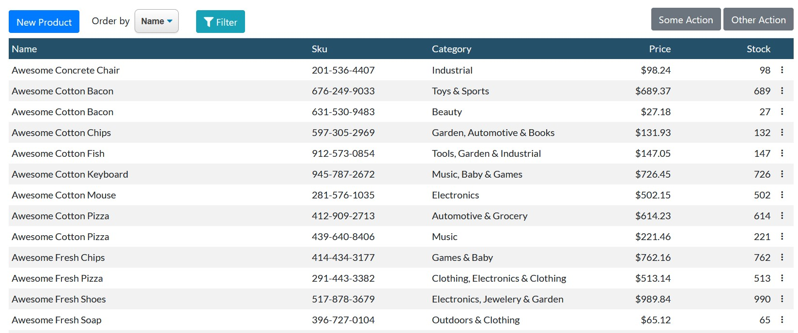

# MoonGrid

## Summary

Yet Another grid for Blazor.

Documentation still missing, see the included sample to understand how it works.

See a live sample at [https://pablopioli.github.io/MoonGrid](https://pablopioli.github.io/MoonGrid)

Warning (1): This project has reached basic functionality, but it still is a work in progress.

Warning (2): This component is very opiniated (albeit customizable). For example, it requires Bootstrap 4.

Available on Nuget as MoonGrid.

## Main Features

* Responsive
* Customizable
* Localizable
